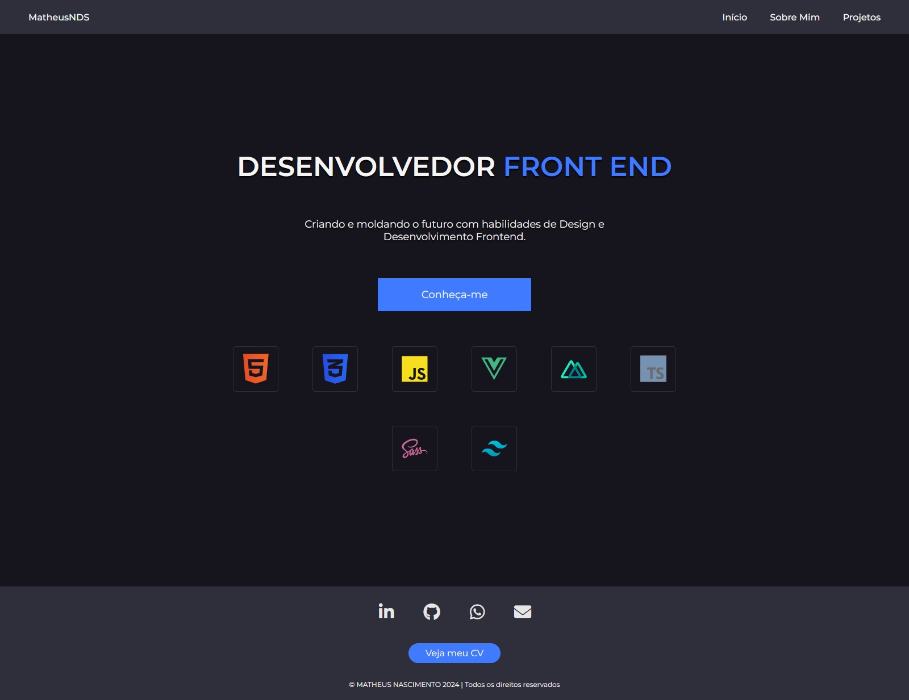

<h1 align="center">Apresento meu <a href="https://my-portfolio-alpha-ruby.vercel.app/">portólio</a>!</h1>

 

 

Esse é meu portfólio para que as pessoas possam me conhecer melhor. Aqui eu apresento minhas habilidades tecnológicas e meus principais objetivos como, também, os meu projetos que mais impactaram minha jornada na programação até agora.

<b>Obs</b>: Se quiser ver o projeto em funcionamente, clique na palavra "portfólio" no título. 👍

 

## Quais tecnologias eu utlizei ??

Pra começar eu utilizei <b>Vite</b> para criação do projeto e suas configurações, tive alguns probleminhas por ser novo utilizando haha. Decidi utilizar o <b>Vue</b> como framework para a organização e separação de componentes junto com a técnica de <b>Atomic Design</b>, <b>Typescript</b> para a interatividade e nesse projeto queria usar somente o <b>CSS</b>, sem SASS.

As imagens da página <i>sobre mim</i> foram criadas com IA.

 

## Como foi a criação do projeto e quais as dificuldades ??

Esse projeto foi concerteza o que mais tive problemas em criar. Porque? Eu criei o design dele pelo <b>Figma</b> e eu queria que ficasse com um design bom e com algumas interatividades para que chama-se atenção de quem tivesse explorando ele, e isso me fez enrolar demais para sua criação por sempre estar alterando algo. A escolha das tecnologias, também, foram um problema por eu sempre ter problemas de configuração do projeto. Vou listar minhas dificuldades:

- Perfeccionismo no design
- Escolha das técnologias
- Configuração do projeto
- Organização e separação dos componentes

 

## Minha experiência ao criar meu portfólio

Apesar das várias dificuldades e problemas que tive com esse ele, quando eu finalmente completei me senti muito realizado. Foi uma sensação muito boa e fiz um <a href="https://www.linkedin.com/feed/update/urn:li:activity:7168302445419335681/?commentUrn=urn%3Ali%3Acomment%3A(ugcPost%3A7168302151570591744%2C7171569240494301184)&dashCommentUrn=urn%3Ali%3Afsd_comment%3A(7171569240494301184%2Curn%3Ali%3AugcPost%3A7168302151570591744)">post</a> apresentando ele no linkedin que tiveram muito mais alcance que eu pensava que teria e que me confirmou que meu trabalho duro realmente valeu a pena.

### Conheça-me

<a href="mailto:matheusnascimentox725@gmail.com">
